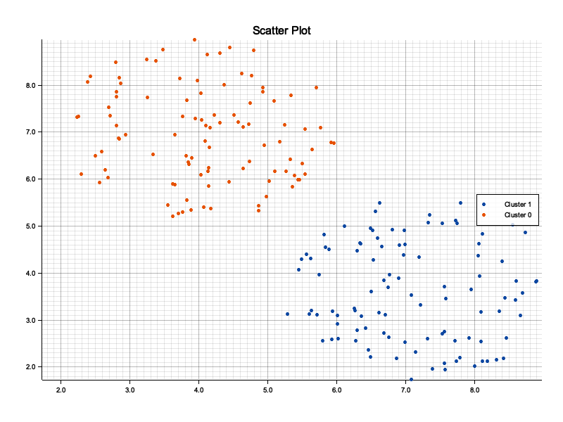
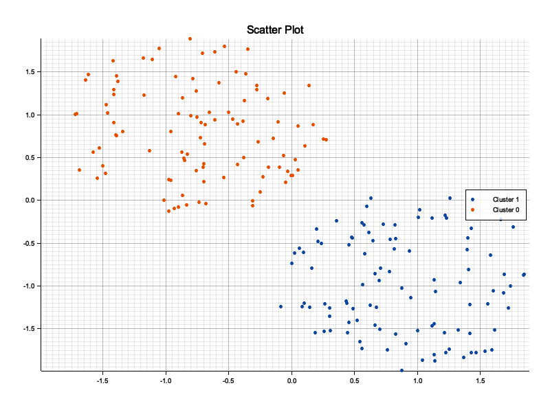
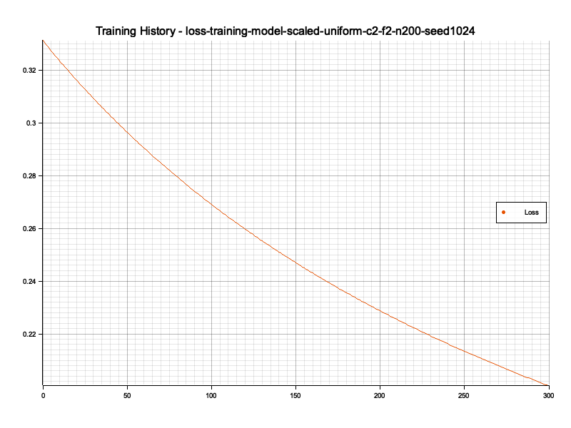
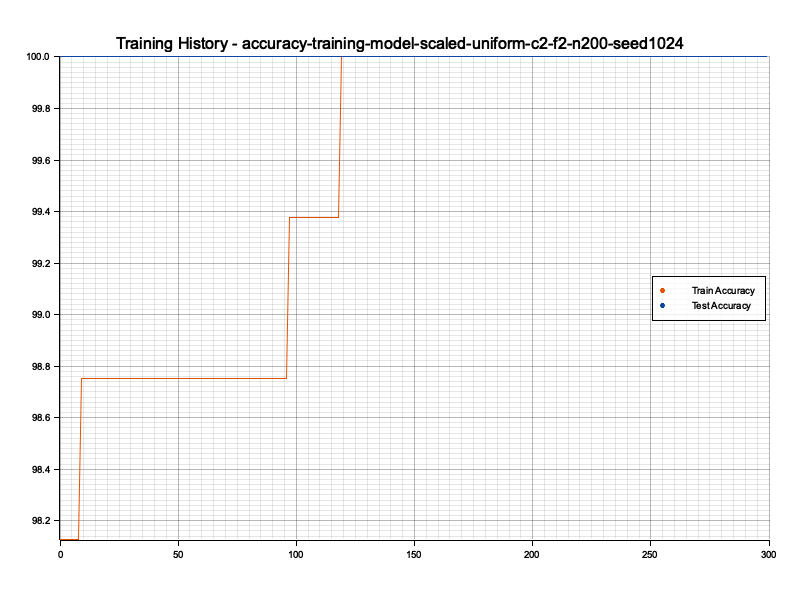
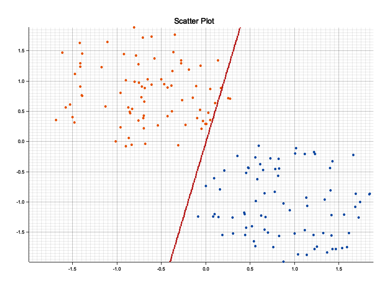

# Neuron Network CLI

This project is a personal educational initiative aimed at learning Rust and understanding the fundamentals of neural networks. The main goal is to explore how neural networks work by implementing them from scratch in Rust, while also gaining hands-on experience with the language and its ecosystem.

As this is an educational project, if you notice any mistakes or have suggestions for clarification, please feel free to open an issue or otherwise provide constructive feedback. Your input is welcome and will help strengthen my understanding!

Currently, the project implements feedforward neural networks, including both single-layer perceptrons (SLP, also known as simple perceptrons) and multi-layer perceptrons (MLP). A single-layer perceptron is the simplest form of a neural network, consisting of an input layer directly connected to an output layer, with no hidden layers. A multi-layer perceptron extends this by adding one or more hidden layers between the input and output, allowing the network to model more complex relationships. Each neuron (except for the input nodes) uses a nonlinear activation function.

The command-line interface (CLI) provides several commands to generate synthetic data, encode and scale datasets, train models, make predictions, and visualize training history. This project is a work in progress and serves as a learning platform rather than a production-ready tool.

## Activation Functions

The CLI automatically selects the activation function for each layer based on the network architecture:

- **ReLU (Rectified Linear Unit)** is used for all hidden layers. It outputs the input directly if it is positive; otherwise, it outputs zero. ReLU is widely used for hidden layers due to its simplicity and effectiveness in deep networks.
- **Sigmoid** is used for the output layer if there is only one output neuron (binary classification or regression between 0 and 1). It maps input values to the range (0, 1) and introduces non-linearity to the network.
- **Softmax** is used for the output layer if there are multiple output neurons (multi-class classification). It converts a vector of values into a probability distribution, where the sum of all outputs is 1.

## Gradient Clipping

To prevent the problem of exploding gradients during training, this project implements gradient clipping using the L2 norm. During each training step, before updating the weights and biases, the gradients for each layer are clipped if their combined L2 norm exceeds a specified maximum value (`max_norm`). This ensures that the updates remain stable and helps the network converge more reliably.

The `max_norm` value can be set as a parameter during training. Gradient clipping is automatically applied to all layers at each update step.

## Example Usage

Below is a typical workflow using the CLI to generate a synthetic dataset, visualize it, scale the data, train a single-layer perceptron (SLP), visualize training metrics, and make predictions.

### 0. Change to the examples directory

Before running the following commands, change to the `examples` directory to ensure correct file path handling:

```sh
cd examples
```

> [!IMPORTANT]
> All subsequent commands should be run from the `examples/` directory. This avoids file not found errors or incorrect file paths.

### 1. Generate a synthetic dataset (2 uniform clusters) and visualize

```sh
nrn synth --seed 1024 --distribution uniform --samples 200 --features 2 --clusters 2 --plot
```
- Generates a dataset with 2 clusters, 2 features, 200 samples, and visualizes the data (plotting requires exactly 2 features).
- The output files are automatically named. For example, with the above command, the dataset is saved as `uniform-c2-f2-n200-seed1024.h5` and the plot as `uniform-c2-f2-n200-seed1024.png`.

> [!IMPORTANT]
> The seed value is important for dataset quality. Some seeds may produce overlapping clusters; pay attention to the seed choice to ensure well-separated clusters if needed.

**Example of generated dataset:**



### 2. Scale the dataset and visualize the scaled data

Normalizing (scaling) the features of your dataset is important because neural networks are sensitive to the scale of input data. Features with different scales can negatively impact the convergence speed and stability of training, and may cause the model to give more importance to features with larger values. Normalization ensures that all features contribute equally to the learning process and helps the optimizer perform better.

You can scale the dataset using either min-max scaling or z-score normalization, depending on your needs:

- **Min-max scaling** brings all feature values into the [0, 1] range. This is useful for bounded data or when you want to preserve the shape of the distribution.
- **Z-score normalization** (standardization) centers the data around 0 with a standard deviation of 1. This is often more appropriate for unbounded or non-image data, as it makes features comparable in terms of variance and is robust to outliers.

For this synthetic dataset (not images), z-score normalization is often a good choice:

```sh
nrn scale uniform-c2-f2-n200-seed1024 z-score --plot
```
- Scales the features of the dataset using z-score normalization and visualizes the scaled data.

This command generates several new files:
- `scaled-uniform-c2-f2-n200-seed1024.h5` : the scaled dataset, ready for training.
- `scaled-uniform-c2-f2-n200-seed1024.png` : a plot visualizing the scaled data (useful to check the effect of normalization).
- `scaler-uniform-c2-f2-n200-seed1024.json` : a JSON file containing the scaling parameters (mean and standard deviation for each feature in the case of z-score). This file is required to apply the same scaling to new data at prediction time, ensuring consistency between training and inference.

**Example of scaled data visualization:**

*Be attentive to the scale: after normalization, the clusters may look similar to the original, which is expected and a sign that the scaling preserved the structure of the data.*



### 3. Train a Single-Layer Perceptron (SLP)

```sh
nrn train scaled-uniform-c2-f2-n200-seed1024 --epochs 3000
```
- Trains a perceptron (no hidden layers; the CLI automatically detects this from the data and does not add hidden layers).
- `--epochs` sets the number of training epochs. For this dataset, 3000 epochs are recommended to achieve good convergence.
- The learning rate and gradient clipping (max-norm) use their default values unless specified otherwise.

**Example output:**

```
/// Dataset loaded (2 features, 160 training samples, 40 test samples)
/// Neural network initialized ([2] -> 1-sigmoid)
*** Training -- 3000 epochs, learning rate: 0.001
*** History -- 300 checkpoints will be recorded, one every 10 epochs
>> Training completed -- Loss: 0.20057073 -- Train Accuracy: 100 -- Test Accuracy: 100
>> Model saved at model-scaled-uniform-c2-f2-n200-seed1024 (HDF5)
>> Training history saved at training-model-scaled-uniform-c2-f2-n200-seed1024 (HDF5)
```

> [!NOTE]
> The network architecture is generated automatically based on the dataset and parameters (here, `[2] -> 1-sigmoid` means 2 input features, no hidden layers, and 1 output neuron with a sigmoid activation). The model and history filenames are prefixed with the dataset name to ensure traceability and avoid confusion when working with multiple datasets or experiments.

- The model is saved as `model-scaled-uniform-c2-f2-n200-seed1024.h5` (contains the trained network architecture and weights, used for predictions).
- The training history is saved as `training-model-scaled-uniform-c2-f2-n200-seed1024.h5` (contains the evolution of loss and accuracy during training, used for analysis and visualization).
- The CLI reports the final loss, training accuracy, and test accuracy.

### 4. Visualize training history (loss, accuracy, decision boundary)

```sh
nrn plot training-model-scaled-uniform-c2-f2-n200-seed1024 --dataset scaled-uniform-c2-f2-n200-seed1024
```
- Plots the training history (loss, accuracy) and, if 2D, the decision boundary.

**Example output:**
```
/// Training history loaded (300 checkpoints, one every 10 epochs)
>> Training history plots saved at training-model-scaled-uniform-c2-f2-n200-seed1024 (PNG)
>> Decision boundary animation saved at training-model-scaled-uniform-c2-f2-n200-seed1024 (GIF)
```

This command generates several files in the `examples/` directory:
- `training-model-scaled-uniform-c2-f2-n200-seed1024.gif` : animation of the decision boundary evolution during training.
- `loss-training-model-scaled-uniform-c2-f2-n200-seed1024.png` : plot of the loss over epochs.
- `accuracy-training-model-scaled-uniform-c2-f2-n200-seed1024.png` : plot of the accuracy over epochs.

**Example outputs:**

*The loss curve shows how the model's error decreases during training, indicating learning progress and convergence.*



*The accuracy curve shows the proportion of correct predictions during training (train accuracy) and on the validation/test set (test accuracy). Comparing both helps to assess model performance and detect overfitting (train accuracy much higher than test accuracy) or underfitting (both low).* 



*The decision boundary animation shows how the model's classification regions evolve during training. It helps to visually understand how the network learns to separate the clusters and how quickly the boundary stabilizes. This is especially useful for 2D datasets to interpret the model's learning dynamics.*



### 5. Make predictions

```sh
nrn predict model-scaled-uniform-c2-f2-n200-seed1024 --scaler scaler-uniform-c2-f2-n200-seed1024
```
- Uses the trained model to make predictions on new data.
- The `--scaler` option ensures the same scaling is applied as during training.
- The `--input` option is optional: if not provided, the CLI will prompt you to enter the feature values directly in the terminal.

**Interactive example:**

```sh
nrn predict model-scaled-uniform-c2-f2-n200-seed1024 --scaler scaler-uniform-c2-f2-n200-seed1024
/// Neural network loaded ([2] -> 1-sigmoid)
/// Scaler loaded (z-score)
Input[0]:
5
Input[1]:
3
Predictions for [-0.23714493, -1.3086028]
|> 1: 62.23%
|> 0: 37.77%
```

- The entered values are automatically normalized (here, [-0.23714493, -1.3086028]).
- The result displays the probability for each class; the predicted class is the one with the highest percentage.
- To predict multiple examples at once, you can provide an HDF5 file with the `--input` option (only `.h5` files are supported).
