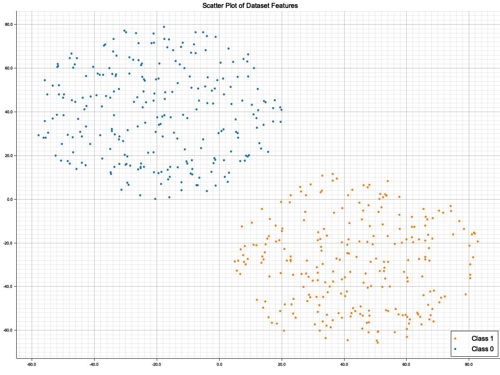
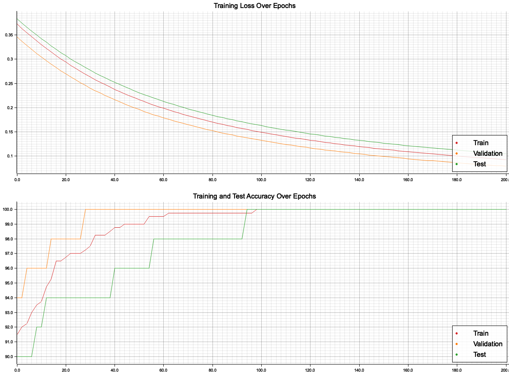
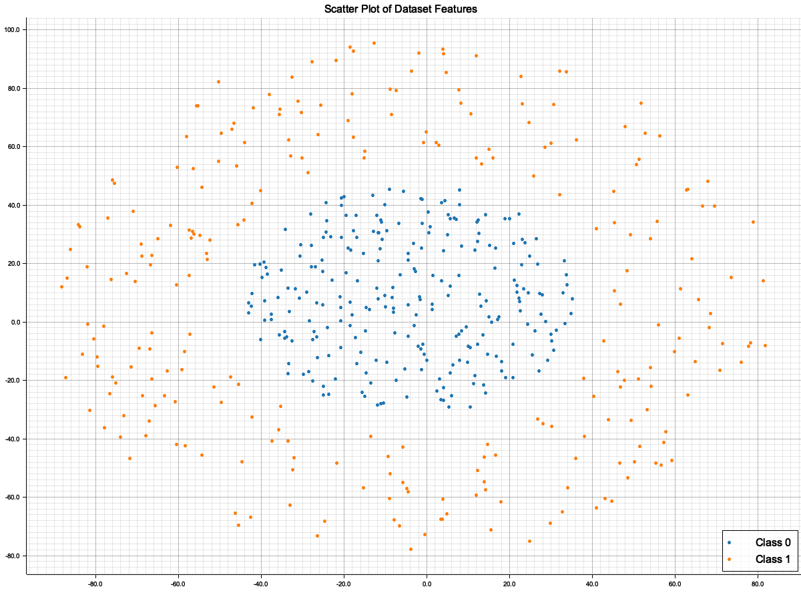
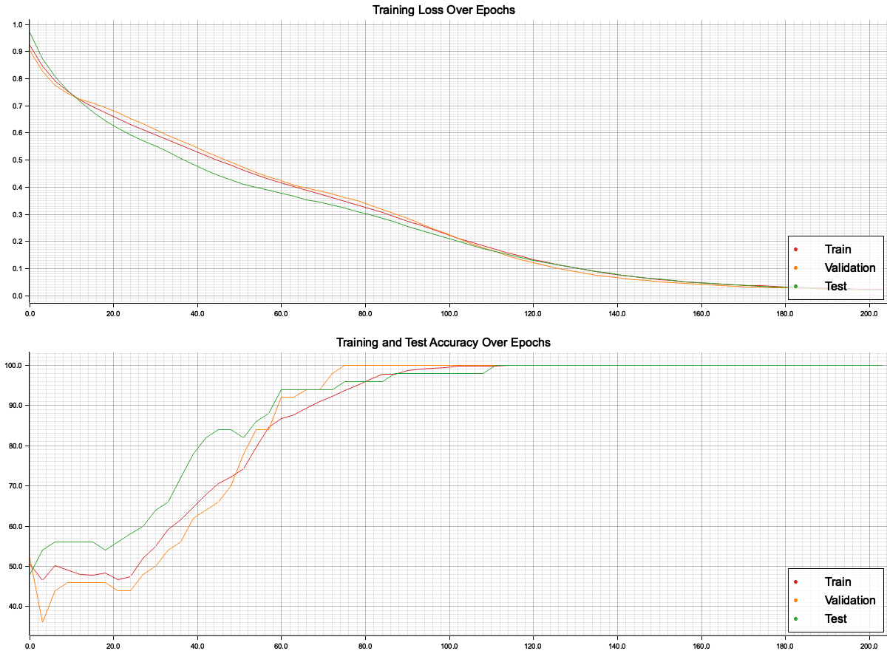
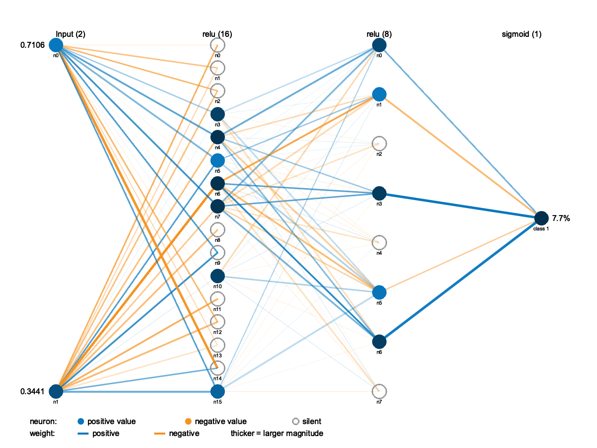
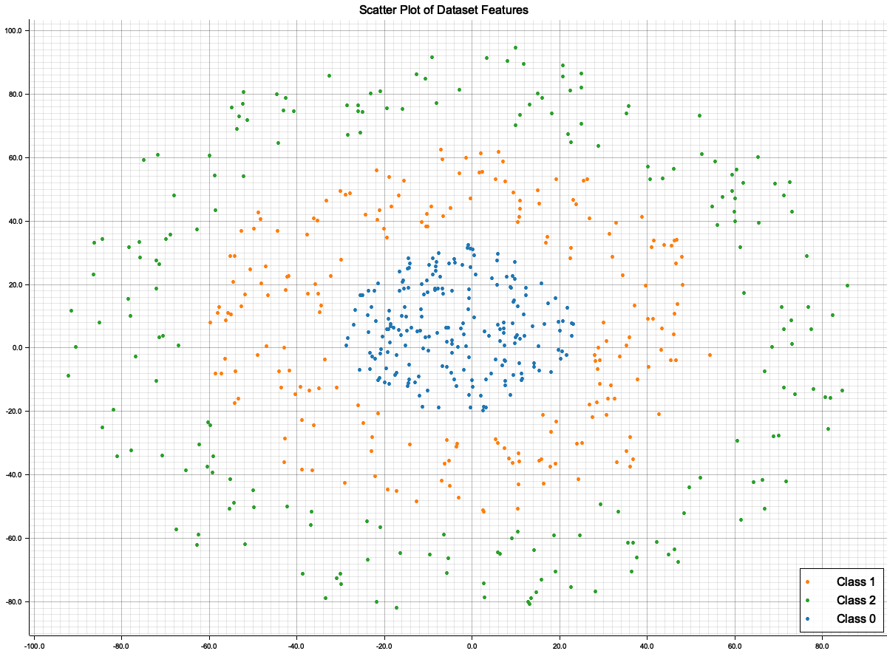
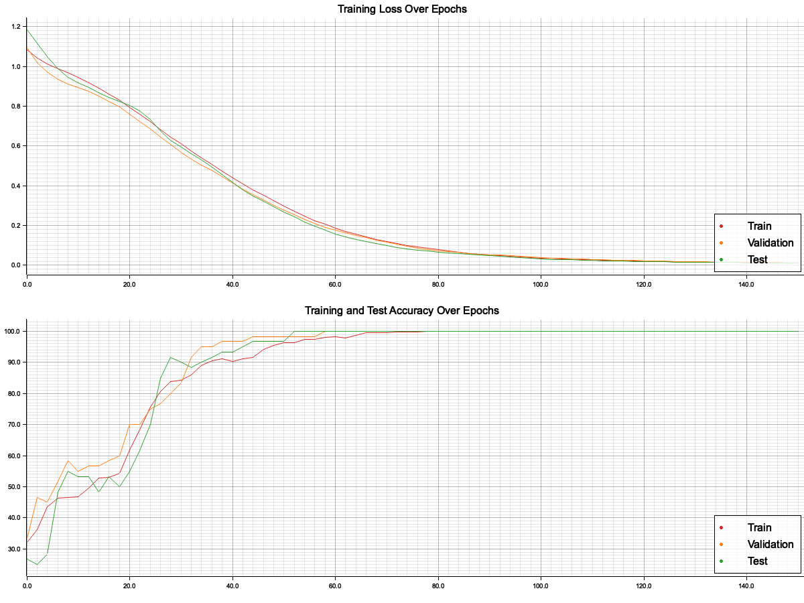

<div align="center">

# 🧠 nrn — neural networks from scratch, in Rust

**A feedforward neural-network library and CLI, built from first principles — no ML framework, no C dependencies, pure Rust.**

[](LICENSE)
[](https://www.rust-lang.org/)

[](https://conventionalcommits.org)

A multi-layer perceptron learning to untangle two interleaved spirals — a problem with no linear solution:


</div>

---

This is a personal, educational project: an attempt to *truly* understand neural networks by implementing
every piece — forward and backward passes, optimizers, schedulers, losses, weight initialization — without
leaning on an existing ML library. Rust keeps it honest (and fast). Everything from data generation to
inference is driven by a single CLI, `nrn`.

Spotted a mistake or a clearer way to explain something? Issues and feedback are very welcome — they sharpen
the learning.

## ✨ Highlights

- **From scratch, no magic** — the math (backprop, gradients, init) is in the source, not a dependency.
- **SLP & MLP** — single- and multi-layer perceptrons, architecture inferred automatically from the data.
- **A full ML workflow** — `synth` → `train` → `plot` → `predict`, each a CLI subcommand.
- **Real training stack** — SGD / Adam, weight decay (decoupled **AdamW** / SGD L2), learning-rate
  schedulers (step, cosine with warm restarts), gradient clipping, **early stopping**, mini-batches.
- **Built-in visualization** — loss/accuracy curves and **animated decision boundaries**, rendered to PNG/GIF
  or straight into your terminal.
- **Synthetic playgrounds** — `uniform`, `ring` and `spiral` generators to probe what each architecture can
  and cannot learn.
- **Beyond toys** — encode folders of images (e.g. MNIST digits) and train a real classifier.
- **Pure-Rust I/O** — datasets are [Parquet](https://parquet.apache.org/); models and checkpoints are
  [safetensors](https://github.com/huggingface/safetensors); no system libraries required to build or run.

## 📑 Table of Contents

- [How it works](#-how-it-works)
- [Concepts](#-concepts)
  - [Activation functions](#activation-functions)
  - [Feature scaling](#feature-scaling)
  - [Gradient clipping](#gradient-clipping)
  - [Early stopping](#early-stopping)
- [Getting started](#-getting-started)
- [Tutorials](#-tutorials)
  - [1 · A line is enough: SLP on separable data](#1--a-line-is-enough-slp-on-separable-data)
  - [2 · When a line fails: MLP on rings](#2--when-a-line-fails-mlp-on-rings)
  - [3 · Many classes at once: multi-class MLP](#3--many-classes-at-once-multi-class-mlp)
- [Going further: handwritten digits (MNIST)](#-going-further-handwritten-digits-mnist)
- [Development](#-development)
- [License](#-license)

## 🔭 How it works

The CLI mirrors the lifecycle of a machine-learning experiment. Each step produces files the next step
consumes:

```
 nrn synth  ─▶  nrn train  ─▶  nrn plot  ─▶  nrn predict
   data          model         charts        inference
 (.parquet)      (model dir)   (PNG / GIF)   (class probabilities)
```

- **`synth`** generates a labelled 2-D dataset (and previews it right in the terminal).
- **`train`** fits a network, optionally fitting a feature scaler on the way; the scaler is bundled *inside*
  the model directory, so it travels with the network.
- **`plot`** turns a dataset or a finished run into figures — scatter plots, training curves, decision
  boundaries (still or animated), or a forward-pass activation diagram for a single instance.
- **`predict`** loads a model directory and classifies new instances — no need to re-specify the scaler
  (add `--activations` to print the forward-pass diagram first).

## 📚 Concepts

### Activation functions

The CLI picks an activation per layer automatically, based on the architecture:

| Layer | Activation | Why |
| --- | --- | --- |
| Hidden | **ReLU** | Cheap, effective, the default workhorse for hidden layers (He init). |
| Output, 1 neuron | **Sigmoid** | Binary classification — squashes to a single probability in (0, 1). |
| Output, *N* neurons | **Softmax** | Multi-class — a probability distribution summing to 1. |

A 2-class problem becomes a single sigmoid output; 3+ classes become a softmax over *N* neurons.

### Feature scaling

Neural networks are sensitive to the scale of their inputs: features with large ranges dominate the
gradient and slow convergence. Pass `--scale` to `train` to fit a scaler on the **training split** and apply
it everywhere:

- **`min-max`** maps each feature into `[0, 1]` — good for bounded data (e.g. pixels).
- **`z-score`** centers each feature to mean 0, standard deviation 1 — a robust default for unbounded data.

The fitted scaler is saved next to the network in the model directory, so `predict` re-applies the exact same
transformation automatically.

### Gradient clipping

To tame exploding gradients, every update is clipped before it is applied:

- **`--clip-norm <N>`** *(default, 1.0)* — rescales the gradient if its L2 norm exceeds `N`, preserving
  direction.
- **`--clip-value <V>`** — clamps each component to `[-V, V]`. Simpler, but changes direction.
- **`--no-clip`** — disables clipping entirely.

### Early stopping

`--early-stopping <patience>` monitors validation loss and stops once it stops improving for `patience`
epochs, restoring the best model seen. It also **recovers gracefully from divergence** (NaN/Inf): if training
blows up, the best earlier model is restored instead of losing the run. Handy for deeper networks on hard,
separable problems — and used throughout the tutorials below.

## 🚀 Getting started

### Prerequisites

Rust **edition 2024** (MSRV 1.88). Install or update via [rustup.rs](https://rustup.rs/):

```sh
rustup update
rustc --version   # should be >= 1.88
```

Optionally, [Task](https://taskfile.dev) runs the project's common commands (`brew install go-task/tap/go-task`).

### Build & install

```sh
git clone https://github.com/fmeriaux/nrn.git
cd nrn

cargo install --path cli --locked   # installs the `nrn` binary into ~/.cargo/bin
nrn --help                          # verify the install
```

> [!TIP]
> Prefer not to install? Build with `cargo build --release` (or `task build`) and run the binary from
> `target/release/nrn`.

### A working directory

The tutorials create datasets, models and figures as files. Run them from a scratch directory so your
workspace stays tidy:

```sh
mkdir playground && cd playground
```

## 🎓 Tutorials

Three short walkthroughs, each building on the last. Every command is reproducible — the `--seed` pins
weight initialization and the data split.

> [!NOTE]
> Dataset files are named after what they contain: `{distribution}-seed{seed}-c{classes}-f{features}-n{samples}`.
> Training a dataset `D.parquet` creates a run directory `training-model-D/` and saves the final model
> beside it as `model-D/` (network **plus** its scaler).

### 1 · A line is enough: SLP on separable data

When two classes are linearly separable, a **single-layer perceptron** (no hidden layers) suffices: it only
ever draws a straight line, and here that's all it takes.

**Generate** a dataset of two well-separated blobs:

```sh
nrn synth --seed 1024 --distribution uniform --samples 500 --features 2 --clusters 2
```

This writes `uniform-seed1024-c2-f2-n500.parquet` and, since the data is 2-D, prints a scatter preview
in your terminal. You can also render it to an image:

```sh
nrn plot dataset uniform-seed1024-c2-f2-n500.parquet --format image
```



**Train** a single-layer perceptron, scaling the features with z-score normalization:

```sh
nrn train start uniform-seed1024-c2-f2-n500.parquet \
  --scale z-score --epochs 200 --lr 0.01 --seed 7
```

The CLI infers the architecture (`[2] -> [1]-identity`) and reports the final loss and accuracy. It reaches
**100%** — a straight line cleanly separates the two blobs.

**Visualize** the run — training curves plus an animated decision boundary:

```sh
nrn plot run training-model-uniform-seed1024-c2-f2-n500 --animate --format image
```

| Training curves | Decision boundary forming |
| --- | --- |
|  |  |

**Predict** on a new point (entered interactively, or from a file with `--instance`):

```sh
nrn predict model-uniform-seed1024-c2-f2-n500
```

```
📥 PREDICTOR LOADED
   Architecture ... [2] -> [1]-identity
   Scaler ......... z-score

Feature 0 ▸ -30
Feature 1 ▸ 60

📊 CLASSIFICATION
   Class 0 ... 99.22% ◀
   Class 1 ...  0.78%
```

Raw inputs are scaled automatically before inference, using the scaler bundled with the model.

### 2 · When a line fails: MLP on rings

Now the data is two **concentric rings** — an inner blob surrounded by an outer ring. No straight line can
separate them.

```sh
nrn synth --seed 1024 --distribution ring --samples 500 --features 2 --clusters 2
```



**A single-layer perceptron is doomed here.** Trained on this data, it keeps rotating its one straight line,
never finding a separation:

```sh
nrn train start ring-seed1024-c2-f2-n500.parquet \
  --scale z-score --epochs 600 --lr 0.01 --seed 7
```


**Add hidden layers** — turning the SLP into a multi-layer perceptron — and the network can bend its
boundary into a closed curve. `--early-stopping` keeps the run robust:

```sh
nrn train start ring-seed1024-c2-f2-n500.parquet \
  --layers 16,8 --scale z-score --epochs 8000 --lr 0.005 \
  --early-stopping 100 --seed 7
```

The architecture becomes `[2] -> [16]-relu -> [8]-relu -> [1]-identity` and accuracy reaches **100%**. The boundary
closes neatly around the inner blob:

| Training curves | Decision boundary forming |
| --- | --- |
|  |  |

**Peek inside the forward pass.** Add `--activations` to `predict` to see how one instance lights up the
network: each neuron is colored by how strongly it fires — positive in blue, negative in orange, hollow when
silent — with the concrete value and an intensity bar beside it. The output layer reads its neurons as class
probabilities, and the ranked decision follows as the classification, its winning class arrow-marked.

```sh
nrn predict model-ring --activations
```

```
Input (2 features)
  ● n0      1.0612  ████████████████████████
  ● n1      0.6778  ███████████████

relu (16 units)
  ○ n0      0.0000                    silent
  ● n5      2.6572  ████████████████████████
  ● n13     1.3679  ████████████
  ● n15     2.1170  ███████████████████
  …

relu (8 units)
  ● n1      7.2430  ████████████████████████
  ○ n4      0.0000                    silent
  ● n5      6.0790  ████████████████████
  …

sigmoid (1 unit)
  ● class 1   92.2%  ██████████████████████

📊 CLASSIFICATION
   Class 1 ... 92.22%  ◀
   Class 0 ...  7.78%
```

`nrn plot activations` renders the same diagram as a pure figure (no ranked decision — that stays with
`predict`). For a horizontal node-link graph instead — neurons as circles labeled by index, output neurons
by class and probability, connections colored by weight sign and weighted by magnitude, with a legend along
the bottom — render it to an image with `nrn plot activations <model> --instance <file> --format image`
(`--max-units` keeps a wide layer's most active neurons, `--min-edge` prunes connections by contribution —
`|weight × activation|`, so a strong weight from a silent neuron is dropped; defaults to `0.01` — `-o/--output`
sets the file, defaulting to `activations-<model>.png` in the current directory). As with `predict`, omit
`--instance` to type the features in at the prompt.



### 3 · Many classes at once: multi-class MLP

Three concentric rings, three classes. The output layer switches to **softmax**, producing a probability per
class.

```sh
nrn synth --seed 1024 --distribution ring --samples 600 --features 2 --clusters 3
```



```sh
nrn train start ring-seed1024-c3-f2-n600.parquet \
  --layers 16,8 --scale z-score --epochs 150 --lr 0.01 --seed 7
```

The CLI builds `[2] -> [16]-relu -> [8]-relu -> [3]-identity` and learns two nested boundaries separating the three
classes:

| Training curves | Decision boundary forming |
| --- | --- |
|  |  |

```sh
nrn plot run training-model-ring-seed1024-c3-f2-n600 --animate --format image
nrn predict model-ring-seed1024-c3-f2-n600
```

The prediction lists every class with its probability; the highest wins.

> [!TIP]
> The spiral at the top of this README is the same recipe pushed further — a wider network
> (`--layers 32,16`) learning to follow two interleaved arms. Try it:
> ```sh
> nrn synth --seed 7 --distribution spiral --samples 800 --features 2 --clusters 2
> nrn train start spiral-seed7-c2-f2-n800.parquet \
>   --layers 32,16 --scale z-score --epochs 40000 --lr 0.005 \
>   --early-stopping 200 --seed 7
> ```

## 🔢 Going further: handwritten digits (MNIST)

The same pipeline scales to real image data. Grab an MNIST-style dataset of digit images organized one folder
per class (`digits/7/img_001.png`, …).

**Encode** the image folders into a dataset (each 28×28 image flattens to 784 features):

```sh
nrn encode dataset digits/ --grayscale --shape 28 --output digits
```

To encode a single image for prediction:

```sh
nrn encode instance digit.png --grayscale --shape 28 --output digit
```

**Train** a classifier — two hidden layers, min-max scaling for pixels, early stopping for safety:

```sh
nrn train start digits.parquet \
  --layers 128,128 --scale min-max --epochs 1000 \
  --batch-size 64 --early-stopping 20 --seed 7
```

The architecture becomes `[784] -> [128]-relu -> [128]-relu -> [10]-identity`. Training on full MNIST is
CPU-intensive — start with a subset to iterate quickly.

> [!NOTE]
> Resume a run (continuing its history and restoring the exact epoch/optimizer state):
> ```sh
> nrn train resume training-model-digits --epochs 1000
> nrn train resume training-model-digits --from 500 --epochs 1000   # rewind to a checkpoint
> ```

**Plot** the curves (decision boundaries need 2-D data, so they're skipped here) and **predict**:

```sh
nrn plot run training-model-digits --format image
nrn predict model-digits --instance digit.json
```

```
📥 PREDICTOR LOADED
   Architecture ... [784] -> [128]-relu -> [128]-relu -> [10]-identity
   Scaler ......... min-max
📊 CLASSIFICATION
   Class 7 ... 99.90%
   Class 1 ...  0.03%
   ...
```

## 🛠 Development

`nrn` is a two-crate Cargo workspace — `core/` (the `nrn` library) and `cli/` (the `nrn` binary). Building
from source, the project layout, the `task` commands, and the testing/commit conventions are documented in
[CONTRIBUTING.md](CONTRIBUTING.md). Contributions and feedback are welcome.

## 📄 License

Licensed under the [Apache License 2.0](LICENSE).
