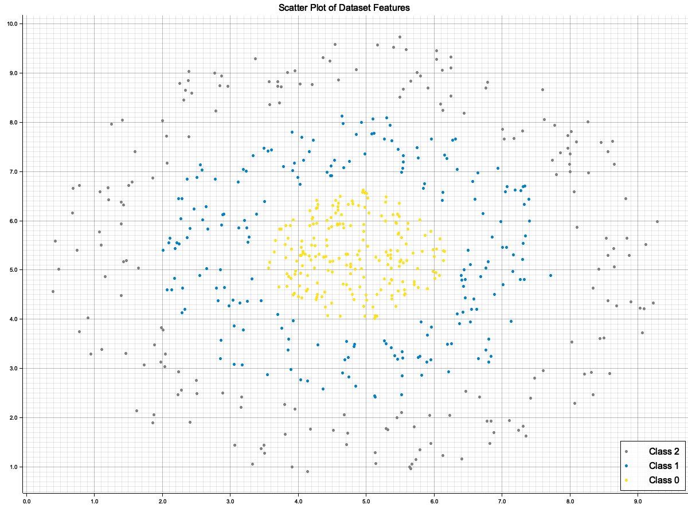
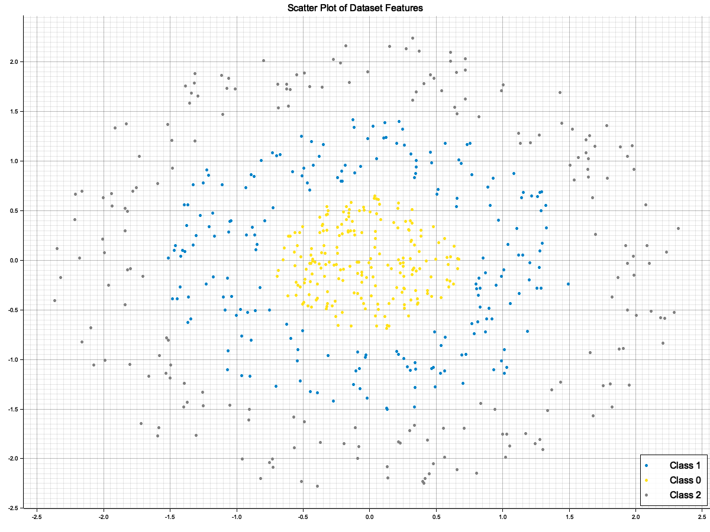
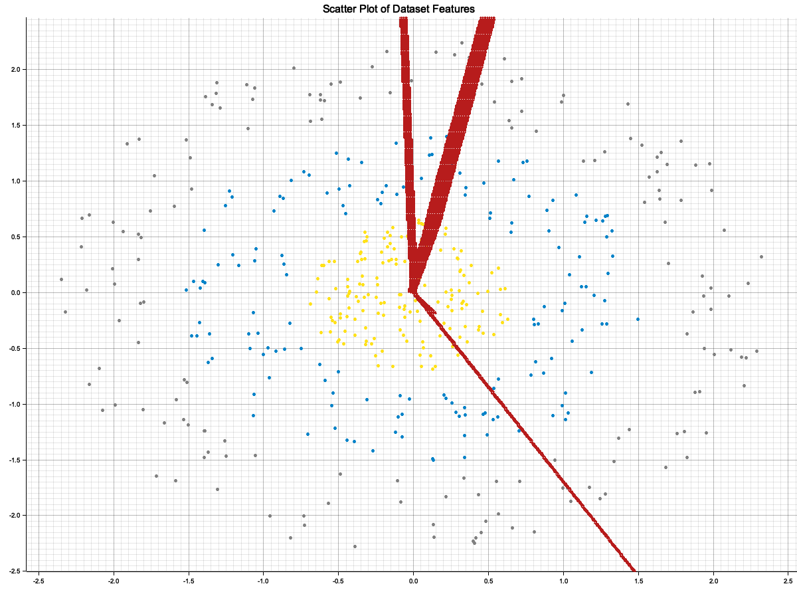

# Neural Network CLI

This project is a personal educational initiative aimed at learning Rust and understanding the fundamentals of neural networks. The main goal is to explore how neural networks work by implementing them from scratch in Rust, while also gaining hands-on experience with the language and its ecosystem.

As this is an educational project, if you notice any mistakes or have suggestions for clarification, please feel free to open an issue or otherwise provide constructive feedback. Your input is welcome and will help strengthen my understanding!

Currently, the project implements feedforward neural networks, including both single-layer perceptron (SLP, also known as single-layer perceptron) and multi-layer perceptron (MLP). A single-layer perceptron is the simplest form of a neural network, consisting of an input layer directly connected to an output layer, with no hidden layers. A multi-layer perceptron extends this by adding one or more hidden layers between the input and output, allowing the network to model more complex relationships. Each neuron (except for the input nodes) uses a nonlinear activation function.

The command-line interface (CLI) provides several commands to generate synthetic data, encode and scale datasets, train models, make predictions, and visualize training history. This project is a work in progress and serves as a learning platform rather than a production-ready tool.

## Table of Contents

- [Concepts](#concepts)
    - [Activation Functions](#activation-functions)
    - [Gradient Clipping](#gradient-clipping)
    - [Data Scaling and Normalization](#data-scaling-and-normalization)
- [Getting Started](#getting-started)
    - [Prerequisites](#prerequisites)
    - [Clone the Repository](#clone-the-repository)
    - [Build the Project](#build-the-project)
    - [Run a Quick Test](#run-a-quick-test)
- [Tutorials](#tutorials)
    - [Tutorial: SLP on Linearly Separable Data](#tutorial-slp-on-linearly-separable-data)
    - [Tutorial: MLP on Non-Linear Data](#tutorial-mlp-on-non-linear-data)
    - [Tutorial: MLP on Multi-Class Non-Linear Data](#tutorial-mlp-on-multi-class-non-linear-data)
- [Going Further: MNIST Use Case](#going-further-handwritten-digit-recognition)

## Concepts

### Activation Functions

The CLI automatically selects the activation function for each layer based on the network architecture:

- **ReLU (Rectified Linear Unit)** is used for all hidden layers. It outputs the input directly if it is positive; otherwise, it outputs zero. ReLU is widely used for hidden layers due to its simplicity and effectiveness in deep networks.
- **Sigmoid** is used for the output layer if there is only one output neuron (binary classification or regression between 0 and 1). It maps input values to the range (0, 1) and introduces non-linearity to the network.
- **Softmax** is used for the output layer if there are multiple output neurons (multi-class classification). It converts a vector of values into a probability distribution, where the sum of all outputs is 1.

### Gradient Clipping

To prevent the problem of exploding gradients during training, this project implements gradient clipping using the L2 norm. During each training step, before updating the weights and biases, the gradients for each layer are clipped if their combined L2 norm exceeds a specified maximum value (`max_norm`). This ensures that the updates remain stable and helps the network converge more reliably.

The `max_norm` value can be set as a parameter during training. Gradient clipping is automatically applied to all layers at each update step.

### Data Scaling and Normalization

Normalizing (scaling) the features of your dataset is important because neural networks are sensitive to the scale of input data. Features with different scales can negatively impact the convergence speed and stability of training, and may cause the model to give more importance to features with larger values. Normalization ensures that all features contribute equally to the learning process and helps the optimizer perform better.

Two common methods are provided:

- **Min-max scaling** brings all feature values into the [0, 1] range. This is useful for bounded data or when you want to preserve the shape of the distribution.
- **Z-score normalization** (standardization) centers the data around 0 with a standard deviation of 1. This is often more appropriate for unbounded or non-image data, as it makes features comparable in terms of variance and is robust to outliers.

When scaling, several files are generated:
- The scaled dataset (ready for training)
- A plot visualizing the scaled data (useful to check the effect of normalization)
- A JSON file containing the scaling parameters (mean and standard deviation for each feature in the case of z-score). This file is required to apply the same scaling to new data at prediction time, ensuring consistency between training and inference.

## Getting Started

Before diving into the tutorials, follow these steps to set up the project and ensure everything is working correctly on your system.

### Prerequisites

This project requires Rust **edition 2024**. You can install or update it from [rustup.rs](https://rustup.rs/). To check your version:
  
```sh
rustc --version
```
> [!NOTE]
> Rust 2024 edition is very recent. If you encounter build errors, update Rust with:

```sh
rustup update
```

**HDF5** 

The CLI uses the HDF5 format for datasets and models. On some systems, you may need to install the HDF5 C library (e.g., `brew install hdf5` on macOS, `sudo apt-get install libhdf5-dev` on Ubuntu).

### Clone the Repository

```sh
git clone https://github.com/fmeriaux/nrn.git
cd nrn
```

### Build the Project

Compile the CLI using Cargo:

```sh
cargo build --release
```

The compiled binary will be located in `target/release/nrn`.

### Run a Quick Test

You can verify your installation by running the following help command:

```sh
target/release/nrn --help
```

This should display the list of available commands and options.

> [!TIP]
> For convenience, you may want to add `target/release` to your `PATH` or create an alias for `nrn`.

### Next Steps

Once the setup is complete, you can proceed to the tutorials below to start generating data, training models, and visualizing results.

## Tutorials

Before running the following commands, change to the `tutorials` directory to ensure correct file path handling:

```sh
cd tutorials
```

### Tutorial: SLP on Linearly Separable Data

Below is a typical workflow using the CLI to generate a synthetic dataset, visualize it, scale the data, train a single-layer perceptron (SLP), visualize training metrics, and make predictions.

#### 1. Generate a uniform dataset

```sh
nrn synth --seed 1024 --distribution uniform --samples 200 --features 2 --clusters 2 --plot
```
**Output files:**
- `uniform-c2-f2-n200-seed1024.h5`: generated synthetic dataset (required for next steps).
- `uniform-c2-f2-n200-seed1024.png`: dataset visualization (only if two features).

> [!IMPORTANT]
> The seed value is important for dataset quality. Some seeds may produce overlapping clusters; pay attention to the seed choice to ensure well-separated clusters if needed.

**Example of generated dataset:**


#### 2. Scale the dataset

See the [Data Scaling and Normalization](#data-scaling-and-normalization) section above for a detailed explanation of the importance and methods of normalization. Here is how to apply normalization in practice:

```sh
nrn scale uniform-c2-f2-n200-seed1024 z-score --plot
```
**Output files:**
- `scaled-uniform-c2-f2-n200-seed1024.h5`: scaled dataset, ready for training.
- `scaled-uniform-c2-f2-n200-seed1024.png`: visualization of the scaled data.
- `scaler-uniform-c2-f2-n200-seed1024.json`: scaling parameters (mean, std; required for prediction to ensure consistency).

**Example of scaled data visualization:**

*Be attentive to the scale: after normalization, the clusters may look similar to the original, which is expected and a sign that the scaling preserved the structure of the data.*


#### 3. Train a Single-Layer Perceptron (SLP)

```sh
nrn train scaled-uniform-c2-f2-n200-seed1024 --epochs 3000
```
**Output files:**
- `model-scaled-uniform-c2-f2-n200-seed1024.h5`: trained model (architecture and weights; required for prediction).
- `training-model-scaled-uniform-c2-f2-n200-seed1024.h5`: training history (loss, accuracy; for analysis and visualization).

> [!NOTE]
> The network architecture is generated automatically based on the dataset and parameters (here, `[2] -> 1-sigmoid` means two input features, no hidden layers, and one output neuron with a sigmoid activation). The model and history filenames are prefixed with the dataset name to ensure traceability and avoid confusion when working with multiple datasets or experiments.

The CLI also reports the final loss, training accuracy, and test accuracy.

#### 4. Visualize training history (loss, accuracy, decision boundary)

```sh
nrn plot training-model-scaled-uniform-c2-f2-n200-seed1024 --dataset scaled-uniform-c2-f2-n200-seed1024
```
**Output files:**
- `training-model-scaled-uniform-c2-f2-n200-seed1024.gif`: decision boundary animation (only for 2D datasets).
- `loss-training-model-scaled-uniform-c2-f2-n200-seed1024.png`: loss curve.
- `accuracy-training-model-scaled-uniform-c2-f2-n200-seed1024.png`: accuracy curve.

*The loss curve shows how the model's error decreases during training, indicating learning progress and convergence.*


*The accuracy curve shows the proportion of correct predictions during training (train accuracy) and on the validation/test set (test accuracy). Comparing both helps to assess model performance and detect overfitting (train accuracy much higher than test accuracy) or underfitting (both low).* 


*The decision boundary animation shows how the model's classification regions evolve during training. It helps to visually understand how the network learns to separate the clusters and how quickly the boundary stabilizes. This is especially useful for 2D datasets to interpret the model's learning dynamics.*


#### 5. Make predictions

```sh
nrn predict model-scaled-uniform-c2-f2-n200-seed1024 --scaler scaler-uniform-c2-f2-n200-seed1024
```
- Use the trained model to make predictions on new data.
- The `--scaler` option ensures the same scaling is applied as during training.

**Interactive example:**

```sh
nrn predict model-scaled-uniform-c2-f2-n200-seed1024 --scaler scaler-uniform-c2-f2-n200-seed1024
/// Neural network loaded ([2] -> 1-sigmoid)
/// Scaler loaded (z-score)
Input[0]:
5
Input[1]:
3
Predictions for [-0.23714493, -1.3086028]
|> 1: 62.23%
|> 0: 37.77%
```

- The entered values are automatically normalized (here, [-0.23714493, -1.3086028]).
- The result displays the probability for each class; the predicted class is the one with the highest percentage.
- To predict multiple examples at once, you can provide an HDF5 file with the `--input` option (only `.h5` files are supported).

### Tutorial: MLP on Non-Linear Data

In this section, we demonstrate how to use a Multi-Layer Perceptron (MLP) to solve a non-linear classification problem. We'll generate a synthetic dataset consisting of two concentric rings (also known as the "ring" or "circles" dataset), which cannot be separated by a linear decision boundary.

A Single-Layer Perceptron (SLP) is inherently limited to learning linear boundaries and will fail on this type of data. This limitation is clearly visible when training an SLP on the ring dataset:


To solve this problem, we need to add at least one hidden layer, turning our network into an MLP capable of learning non-linear decision boundaries.

#### 1. Generate a ring dataset

```sh
nrn synth --seed 1024 --distribution ring --samples 400 --features 2 --clusters 2 --plot
```
**Output files:**
- `ring-c2-f2-n400-seed1024.h5`: generated synthetic dataset (rings; required for next steps).
- `ring-c2-f2-n400-seed1024.png`: dataset visualization (only if two features).

#### Example of generated dataset:


#### 2. Scale the dataset

Scales the features using z-score normalization and visualizes the scaled data.

```sh
nrn scale ring-c2-f2-n400-seed1024 z-score --plot
```
**Output files:**
- `scaled-ring-c2-f2-n400-seed1024.h5`: scaled dataset, ready for training.
- `scaled-ring-c2-f2-n400-seed1024.png`: visualization of the scaled data.
- `scaler-ring-c2-f2-n400-seed1024.json`: scaling parameters (mean, std; required for prediction).


#### Example of scaled data visualization:


#### 3. Train a Multi-Layer Perceptron (MLP)

```sh
nrn train scaled-ring-c2-f2-n400-seed1024 --layers 32,32 --epochs 30000
```
**Output files:**
- `model-scaled-ring-c2-f2-n400-seed1024.h5`: trained MLP model (required for prediction).
- `training-model-scaled-ring-c2-f2-n400-seed1024.h5`: training history (for analysis and visualization).

Trains an MLP with two hidden layers of 32 neurons each (you can adjust the number and size of hidden layers as needed).
The CLI automatically detects the architecture: `[2] -> 32-relu -> 32-relu -> 1-sigmoid`. 
Hidden layers use the ReLU activation function, as explained in the [Activation Functions](#activation-functions) section above.

#### 4. Visualize training history (loss, accuracy, decision boundary)

```sh
nrn plot training-model-scaled-ring-c2-f2-n400-seed1024 --dataset scaled-ring-c2-f2-n400-seed1024
```
**Output files:**
- `training-model-scaled-ring-c2-f2-n400-seed1024.gif`: decision boundary animation (only for 2D datasets).
- `loss-training-model-scaled-ring-c2-f2-n400-seed1024.png`: loss curve.
- `accuracy-training-model-scaled-ring-c2-f2-n400-seed1024.png`: accuracy curve.


*The decision boundary animation shows how the MLP learns a non-linear separation adapted to the ring structure. This visualization demonstrates the power of MLPs for non-linear problems.*


## Tutorial: MLP on Multi-Class Non-Linear Data

This tutorial demonstrates how to use a Multi-Layer Perceptron (MLP) to solve a non-linear multi-class classification problem. We will generate a synthetic dataset consisting of three concentric rings (three clusters/classes), which cannot be separated by linear boundaries. This example highlights the use of the **Softmax** activation function in the output layer for multi-class classification.

> For background on normalization, MLP architecture, and activation functions, refer to the [Concepts](#concepts) section above.

#### 1. Generate a ring dataset with three clusters

```sh
nrn synth --seed 1024 --distribution ring --samples 600 --features 2 --clusters 3 --plot
```
**Output files:**
- `ring-c3-f2-n600-seed1024.h5`: generated synthetic dataset (required for next steps).
- `ring-c3-f2-n600-seed1024.png`: dataset visualization (only if two features).

> [!NOTE]
> The number of clusters is set to 3 to illustrate multi-class classification. You can adjust the number of samples as needed.

**Example of generated dataset:**



#### 2. Scale the dataset

Normalize the features using z-score normalization and visualize the scaled data:

```sh
nrn scale ring-c3-f2-n600-seed1024 z-score --plot
```
**Output files:**
- `scaled-ring-c3-f2-n600-seed1024.h5`: scaled dataset, ready for training.
- `scaled-ring-c3-f2-n600-seed1024.png`: visualization of the scaled data.
- `scaler-ring-c3-f2-n600-seed1024.json`: scaling parameters (mean, std; required for prediction).

**Example of scaled data visualization:**



#### 3. Train a Multi-Layer Perceptron (MLP)

```sh
nrn train scaled-ring-c3-f2-n600-seed1024 --layers 32,32 --epochs 150000
```
**Output files:**
- `model-scaled-ring-c3-f2-n600-seed1024.h5`: trained MLP model (required for prediction).
- `training-model-scaled-ring-c3-f2-n600-seed1024.h5`: training history (for analysis and visualization).

> [!NOTE]
> The number of epochs is set to 150,000 to ensure proper convergence on this more complex multi-class problem. You may adjust this value depending on your hardware and the desired training duration.

The CLI automatically detects the architecture: `[2] -> 32-relu -> 32-relu -> 3-softmax`. The output layer uses the **Softmax** activation function, which is appropriate for multi-class classification problems. Each output neuron corresponds to one class, and the output values represent the probability for each class.

#### 4. Visualize training history (loss, accuracy, decision boundary)

```sh
nrn plot training-model-scaled-ring-c3-f2-n600-seed1024 --dataset scaled-ring-c3-f2-n600-seed1024 -f 50
```
**Output files:**
- `training-model-scaled-ring-c3-f2-n600-seed1024.gif`: decision boundary animation (only for 2D datasets).
- `loss-training-model-scaled-ring-c3-f2-n600-seed1024.png`: loss curve.
- `accuracy-training-model-scaled-ring-c3-f2-n600-seed1024.png`: accuracy curve.

> [!NOTE]
> The `-f 50` option increases the number of frames in the decision boundary animation, allowing you to better visualize the evolution of the model during training and to make fuller use of the training history.


*The decision boundary animation shows how the MLP learns to separate the three classes. The Softmax output enables the network to model complex, non-linear, multi-class boundaries.*



#### 5. Make predictions

```sh
nrn predict model-scaled-ring-c3-f2-n600-seed1024 --scaler scaler-ring-c3-f2-n600-seed1024
```
- The model outputs a probability for each class (thanks to Softmax). The predicted class is the one with the highest probability.
- You can provide new data interactively or via an HDF5 file (see previous tutorials for details).

**Example output:**

```sh
/// Neural network loaded ([2] -> 32-relu -> 32-relu -> 3-softmax)
/// Scaler loaded (z-score)
Input[0]:
7
Input[1]:
9
Predictions for [0.9694462, 2.0005205]
|> 2: 99.63%
|> 1: 0.37%
|> 0: 0.00%
```

## Going Further: Handwritten Digit Recognition

The MNIST dataset is a classic benchmark for evaluating neural networks on handwritten digit recognition. With the CLI, you can easily prepare, train a model, and make prediction on MNIST-like image data.

You can search online for the MNIST dataset or use any similar dataset of handwritten digits organized in directories by class (png files).

### Encoding Images

To convert a directory of images into a dataset suitable for training, use:

```sh
nrn encode img-dir --seed 42 --input mnist/ --output mnist.h5 --grayscale --shape 28
```
- The directory structure must be `<input-dir>/<class-name>/<image>.png` (e.g., `digits/7/img_001.png`).
- `<class-name>` should be a digit from 0 to 9.
- `--seed` is required and ensures reproducible shuffling.
- `--input` (`-i`) is the path to the root directory of images.
- `--output` (`-o`) is the path to save the encoded dataset (HDF5 file).
- `--grayscale` converts images to grayscale, reducing data size.
- `--shape` (`-s`) resizes images to the given shape (28 for MNIST, default 64).

> [!NOTE]
> The output HDF5 file contains two groups: `train` and `test`, each with `features` and `labels` datasets. The split is performed automatically and reproducibly with the chosen seed. Always use the same seed to reproduce the same split.

To encode a single image for prediction:

```sh
nrn encode img --input digit.png --output digit.h5 --grayscale --shape 28
```
- `--input` (`-i`): path to the image file to encode.
- `--output` (`-o`): path to save the encoded image (HDF5 file).
- `--grayscale`: convert to grayscale.
- `--shape` (`-s`): resize to the specified shape (28 for MNIST).

> [!TIP]
> The encoded image file can be used for prediction with the `predict` command (see below).

### Preprocessing

After encoding, scale the dataset using min-max normalization:

```sh
nrn scale mnist min-max
```
- This creates a scaled dataset (e.g., `scaled-digits.h5`) and a scaler file (e.g., `scaler-digits.json`).
- Always use the scaler file generated from the training dataset for all predictions.

For information on scaling methods, refer to the [Data Scaling and Normalization](#data-scaling-and-normalization) section above.

### Recommended Architecture

For MNIST, a typical architecture is:

```
[784] -> 128-relu -> 128-relu -> 10-softmax
```
- **784**: Each 28x28 image is flattened into a vector of 784 features.
- **128-relu**: Two hidden layers with 128 neurons each and ReLU activation.
- **10-softmax**: Output layer with 10 neurons (digits 0-9), using Softmax for multi-class classification.

Train the model with:

```sh
nrn train scaled-digits --layers 128,128 --epochs 1000
```
- Training on the full MNIST dataset requires significant RAM and CPU/GPU resources.
- For quick tests, use a subset of the data.

You can re-train a previous model by providing the model file, in this case skip the `--layers` option:

```sh
nrn train scaled-digits --model model-scaled-digits --epochs 1000
```

The model file will be updated with the new weights after training.

### Visualizing Training
After training, visualize the training history:

```sh
nrn plot training-model-scaled-digits
```

>![NOTE]
> Decision boundary visualization is not applicable for high-dimensional data like MNIST, so only loss and accuracy plots will be generated.

### Making Predictions

To predict the digit from a new image:

1. Encode the image:
   ```sh
   nrn encode img --input digit.png --output digit.h5 --grayscale --shape 28
   ```
2. Predict using the trained model and the scaler from the original training dataset:
   ```sh
   nrn predict model-scaled-digits --scaler scaler-digits.json -i digit.h5
   ```
- The scaler **must** be the one generated from the original training dataset to ensure consistent preprocessing.
- The output will show the probability for each digit (0-9); the highest value is the predicted class.

**Example output:**
```sh
/// Neural network loaded ([784] -> 128-relu -> 128-relu -> 10-softmax)
/// Scaler loaded (min-max)
Predictions for [0.0, 0.0, ..., 0.0]:
|> 0: 0.01%
|> 1: 0.02%
|> 2: 0.03%
|> 3: 0.01%
|> 4: 0.01%
|> 5: 0.01%
|> 6: 0.01%
|> 7: 99.90%
|> 8: 0.00%
|> 9: 0.00%
```

## License

This project is licensed under the [Apache License 2.0](LICENSE).
